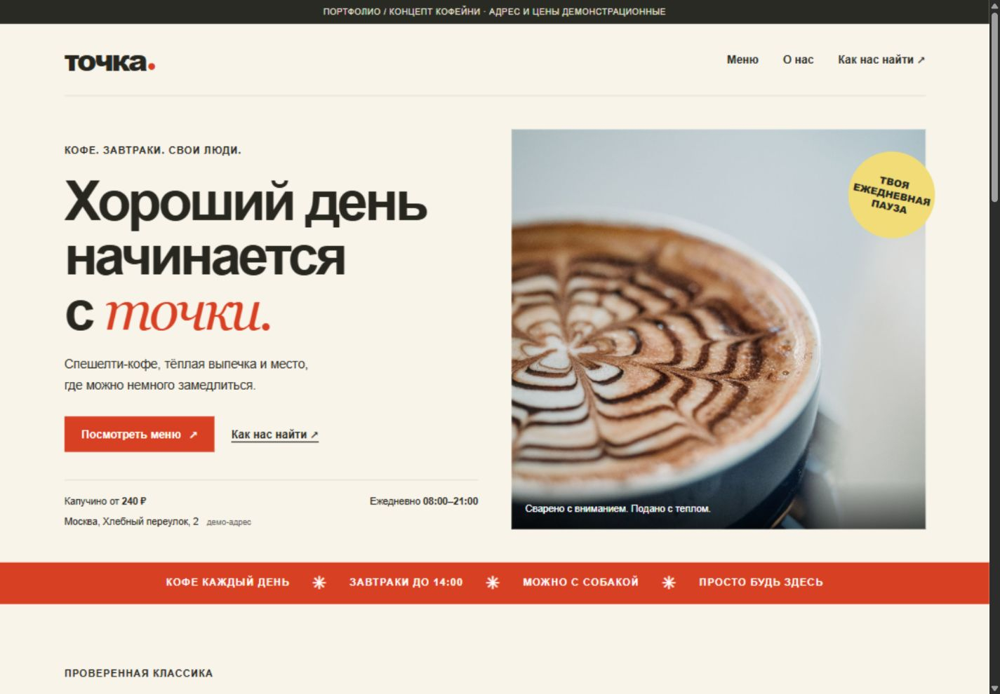
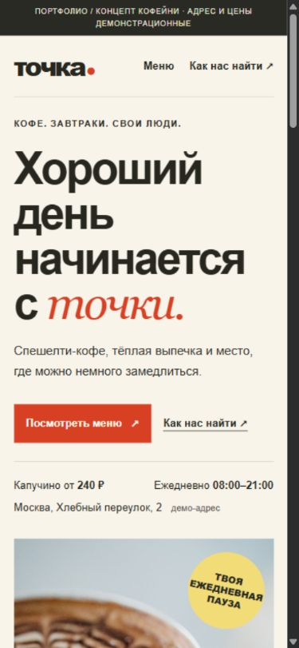
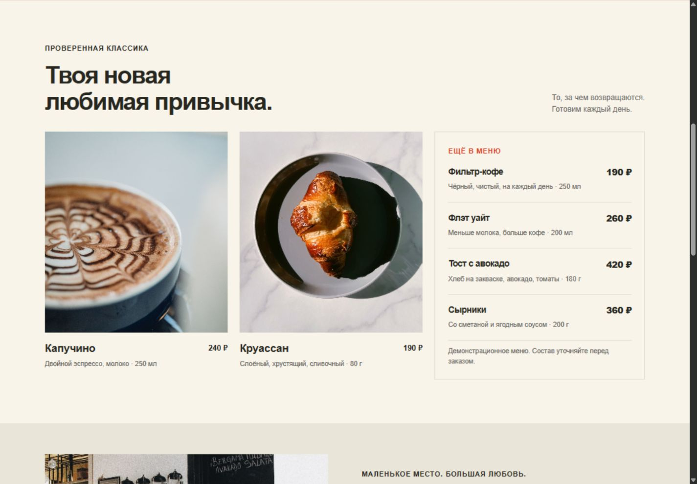
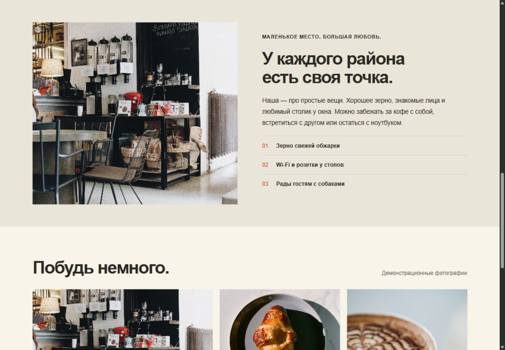
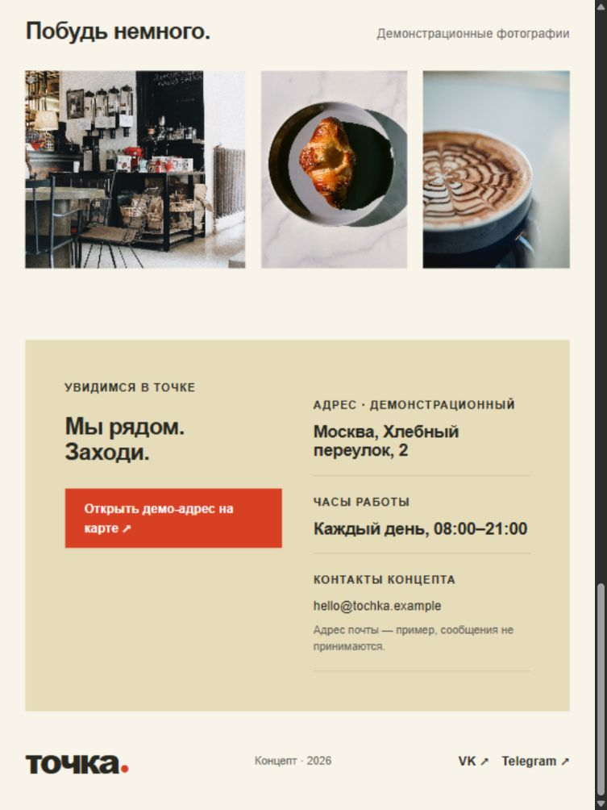

# Точка

Лендинг кофейни. Место, с которого начинается хороший день. Меню, атмосфера и адрес — без лишних шагов.

[Открыть демо](https://Krutoy312.github.io/tochka-coffee/)

## Задача

Помочь гостю с телефона быстро понять, что предлагает кофейня, сколько стоит кофе и куда идти.

## Реализовано

- Адаптивная страница для телефона, планшета и компьютера
- Меню с ценами, объёмом напитков и весом блюд
- Переходы к меню и контактам с первого экрана
- Галерея интерьера и напитков
- Демо-адрес, часы работы и ссылка на карту
- Семантическая разметка, клавиатурная навигация и режим уменьшенного движения

## Попробовать

Откройте страницу → посмотрите цену капучино → нажмите «Посмотреть меню» → перейдите в «Как нас найти».

## Запуск

Node.js 18 или новее. Зависимости не нужны.

```sh
git clone https://github.com/Krutoy312/tochka-coffee.git
cd tochka-coffee
npm start
```

Откройте http://127.0.0.1:4173. Для другого порта: `node server.mjs . 4174`.

Стек: HTML, CSS, JavaScript. Статические файлы публикуются через GitHub Pages.

## Границы демо

Кофейня, адрес, контакты и цены вымышлены. Фотографии демонстрационные. Социальные ссылки ведут на главные страницы платформ, а не на действующие аккаунты кофейни.

## Скриншоты

### Первый экран · компьютер



### Первый экран · телефон



### Меню с ценами



### О кофейне и атмосфера



### Адрес · планшет



### Контакты · телефон


## Проверка

Проверены мобильная, планшетная и настольная ширины; основные переходы и отсутствие горизонтального переполнения. Проверены переходы к меню и адресу, наличие цен и загрузка фотографий.

Источники фотографий — [CREDITS.md](CREDITS.md).

Даты коммитов распределены по этапам демонстрационной разработки и не отражают фактическую длительность работы.
